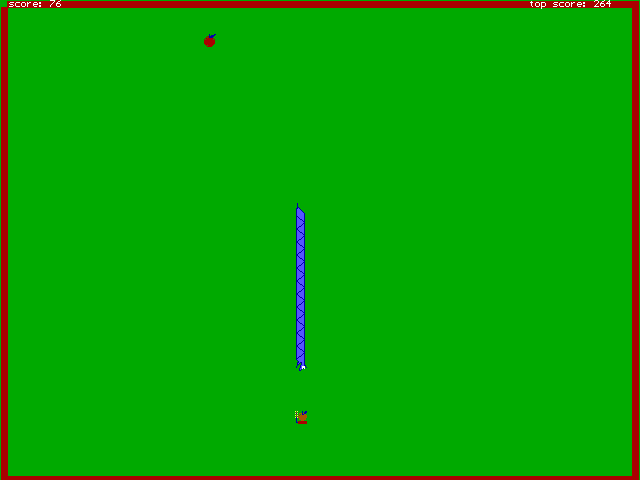
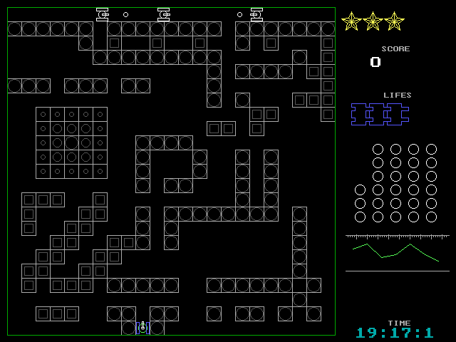
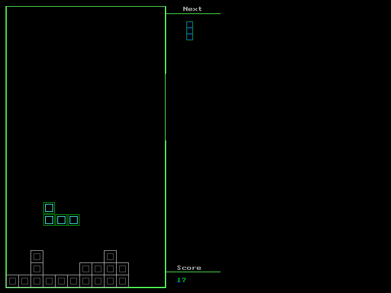
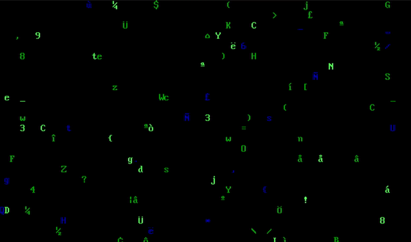

# Pascal Games

Thanks to my teacher Brodicico Valeriu!

* **RÎMA** (Snake)

    <details><summary>Screenshot</summary>  </details>

    * To see the "Game Over" screen

        Rename `RIMA\TOP.IN.game-over` to `RIMA\TOP.IN`

* **TANK**

    <details><summary>Screenshot</summary>  </details>

* **TETRIS**

    <details><summary>Screenshot</summary>  </details>

* **MATRIX** (not game)

    <details><summary>Screenshot</summary>  </details>

## How to Play

0. [Download](https://github.com/01e9/pascal-games/archive/master.zip) the files

### on Windows

1. Install [DOSBox](https://sourceforge.net/projects/dosbox/files/latest/download)

2. Drag and Drop the game exe file on DOSBox desktop icon

    <details><summary>Screenshot</summary>  </details>

### on Linux

1. Install [DOSBox](https://www.google.com/search?q=dosbox+download)

    ```sh
    sudo apt install dosbox
    ```

2. `dosbox GAME_NAME.EXE`

## Fix slow moving

To increase DOSBox speed press CTRL-F12 _(CTRL-F11 to decrease)_.

## Compile

```
cd GAME_NAME
...\TP\BIN\TPC.EXE GAME_NAME.PAS
```

## Turbo Pascal 7.0 

[Download Install](https://mega.nz/#!wotThTaZ!vZhfOvJImK_tdK1h36uv7qpN6-CbpXOoOd9fcri6ZN4)
